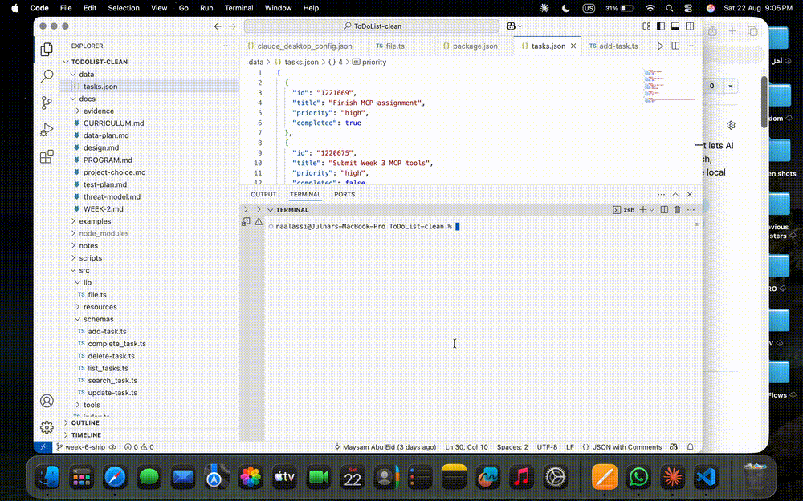

# To-Do List MCP Server

A Model Context Protocol (MCP) server for managing a simple to-do list.

The server allows an AI client to create, view, complete, search, update, and delete tasks using MCP tools. Tasks are stored locally in `data/tasks.json`.

🌐 Live Website: https://to-do-list-six-opal-42.vercel.app/

## Demo



## Requirements

Before running the project, make sure you have:

- Node.js 20 or later
- npm
- Git

You can check your versions with:

```bash
node -v
npm -v
git --version
```

## Install

Clone the repository:

```bash
git clone https://github.com/JulnarAssi/ToDoList.git
cd ToDoList
```

Install the dependencies:

```bash
npm install
```

## Run

To start the MCP server:

```bash
npm run dev
```

The server uses stdio transport and waits for an MCP client connection.

To stop the server, press:

```text
Ctrl + C
```

## Run with MCP Inspector

MCP Inspector can be used to test the tools locally.

Run:

```bash
npm run inspect
```

The Inspector should open in your browser.

In MCP Inspector:

1. Connect to the server if needed.
2. Open the **Tools** tab.
3. Select a tool.
4. Enter the required input.
5. Click **Run Tool** or **Execute**.
6. Check the returned result.

## Available Tools

| Tool | Description |
| --- | --- |
| `add_task` | Create a new task with a title and optional task information. |
| `list_tasks` | Return tasks currently stored in the to-do list. |
| `complete_task` | Mark an existing task as completed using its task ID. |
| `search_task` | Search stored tasks using a keyword in the task title. |
| `update_task` | Update an existing task. |
| `delete_task` | Delete an existing task. |
| `create_calendar_event` | Create a real event in the user's Google Calendar. |

## Google Calendar Integration

This project integrates with the Google Calendar API using OAuth 2.0.

The `create_calendar_event` tool allows the MCP server to create real events in the user's primary Google Calendar.

For example, a user can ask:

> Schedule "Prepare Demo Day" tomorrow from 4 PM to 5 PM.

The AI converts the request into the structured date and time format required by the tool, and the event is then created in Google Calendar.

### Google Calendar Setup

To use the Google Calendar integration:

1. Create a project in Google Cloud.
2. Enable the Google Calendar API.
3. Configure OAuth 2.0 and create a Desktop App OAuth client.
4. Download the OAuth credentials file.
5. Create a `.secrets` directory in the project and save the credentials file as:

```text
.secrets/google-calendar-oauth.json
```

6. Authorize the application by running:

```bash
npx tsx scripts/google-auth.ts
```

After authorization, the OAuth token is stored locally inside the `.secrets/` directory.

The `.secrets/` directory is ignored by Git and must never be committed.

## Example Prompts

Here are some examples of requests that can use the tools:

### Add a task

> Add a high-priority task called "Finish Week 5 report".

### List tasks

> Show me my current tasks.

### Complete a task

> Mark the task with ID 1220675 as completed.

### Search tasks

> Search my tasks for "Week 5".

### Update a task

> Update one of my existing tasks.

### Delete a task

> Delete a task from my to-do list.

### Create a Calendar Event

> Schedule "Prepare Demo Day" tomorrow from 4 PM to 5 PM.

## Data Storage

Tasks are stored locally in:

```text
data/tasks.json
```

The project does not require an external database for task storage.

Google Calendar events are created through the Google Calendar API and are stored in the user's Google Calendar.

## Example Conversations

See [`examples/conversations.md`](examples/conversations.md) for sample user conversations showing the expected MCP tool calls and final assistant responses.

## Troubleshooting

### 1. `npm: command not found`

Node.js and npm may not be installed correctly.

Check:

```bash
node -v
npm -v
```

Install Node.js 20 or later, then try again.

### 2. MCP Inspector does not start

Make sure the dependencies are installed:

```bash
npm install
```

Then run:

```bash
npm run inspect
```

### 3. Failed to load tasks

Make sure `data/tasks.json` exists and contains valid JSON.

For example:

```json
[]
```

A missing file or invalid JSON syntax can prevent the tools from loading task data.

### 4. Google Calendar authorization fails

Make sure:

- The Google Calendar API is enabled in your Google Cloud project.
- You created a Desktop App OAuth client.
- Your OAuth credentials are saved as `.secrets/google-calendar-oauth.json`.
- Your Google account is added as a test user if the OAuth application is still in testing mode.

Then run:

```bash
npx tsx scripts/google-auth.ts
```

## License

This project is licensed under the MIT License.
